# Diagramas de flujo

## Objetivo

Representar visualmente los flujos principales del motor de provisiones. Los diagramas usan Mermaid para poder versionarse como texto.

## Arquitectura funcional por modulos

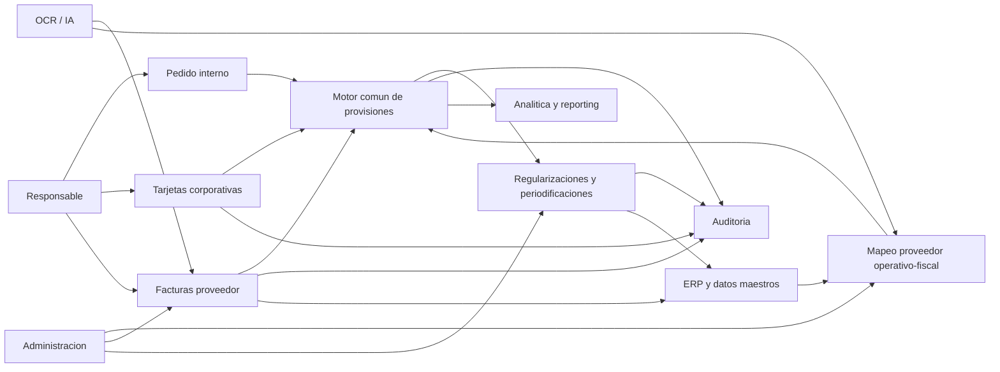

## Modelo SaaS tenant-aware

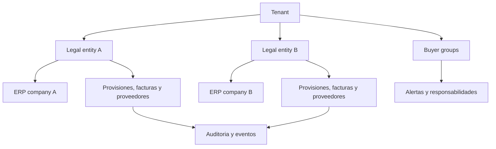

## Routing funcional multi-sociedad

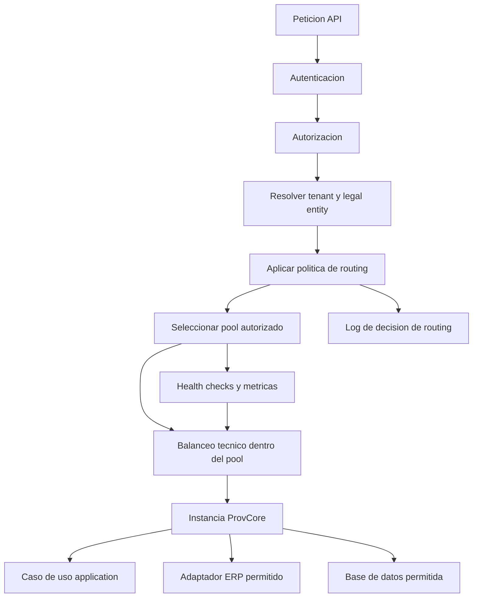

## Flujo principal de gasto provisionado

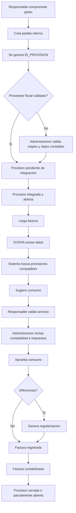

## Factura sin provision previa

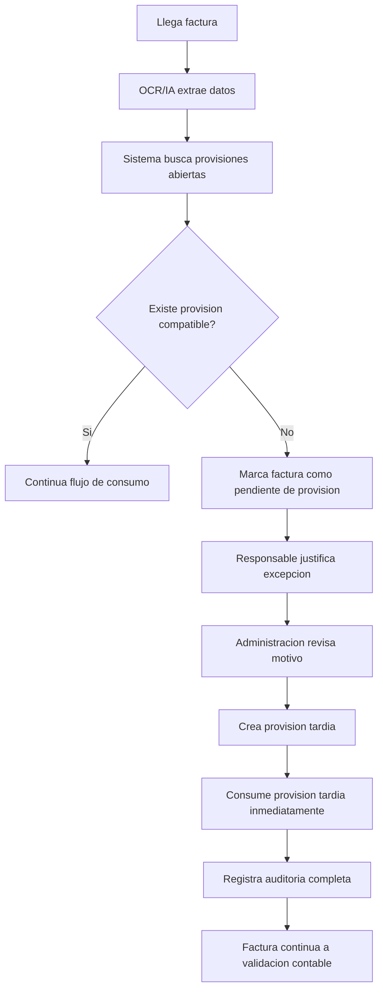

## Mapeo proveedor operativo a proveedor fiscal

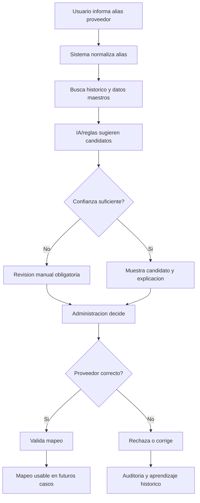

## Alta de proveedor fiscal desde factura

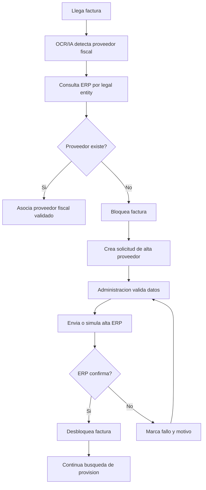

## Consumo N a N entre facturas y provisiones

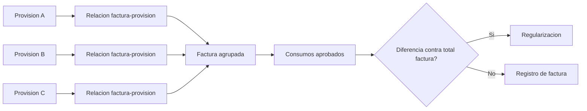

## Movimiento de tarjeta con factura

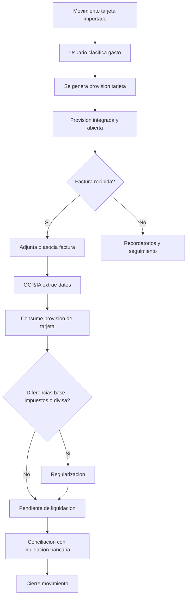

## Movimiento de tarjeta sin factura

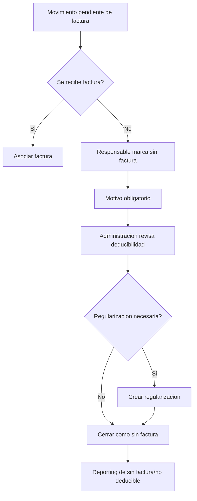

## Alertas de cierre operativo

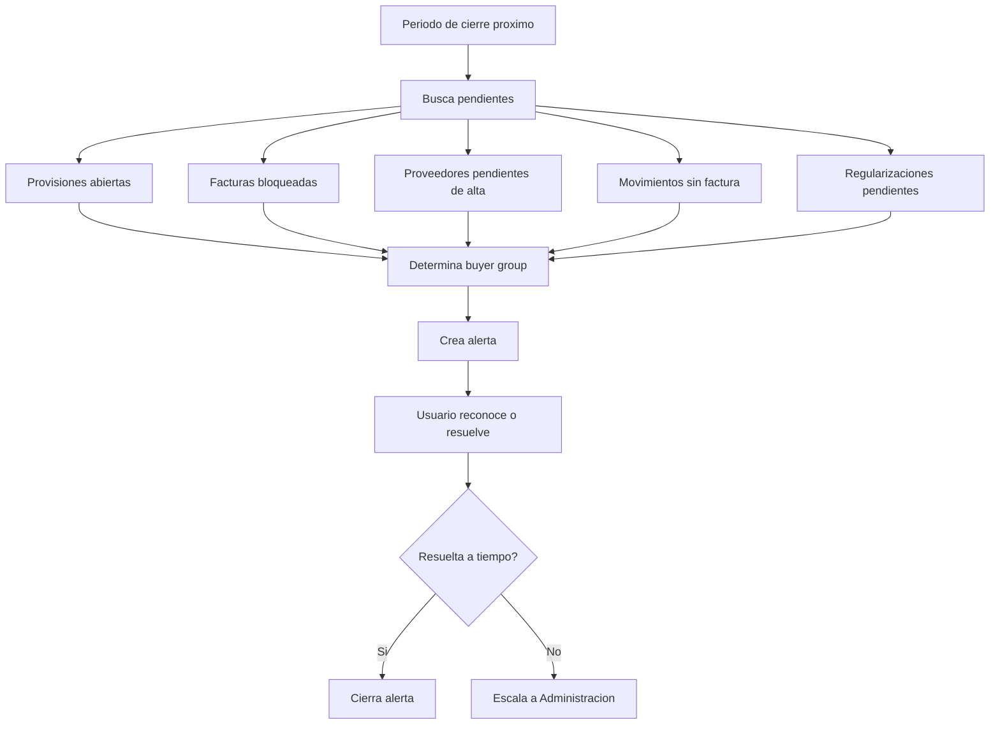

## Ciclo de estados de provision

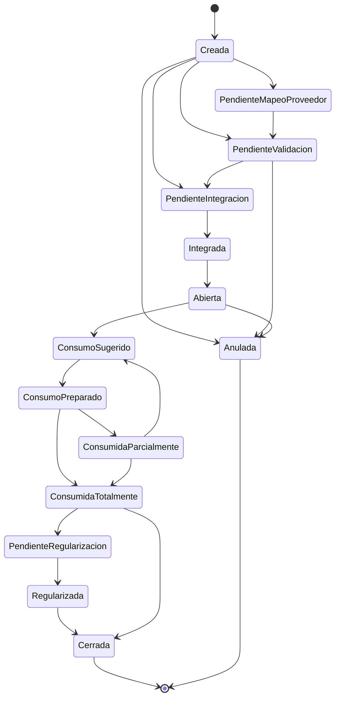

## Responsabilidades de gobierno

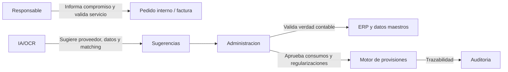

## Modelo entidad-relacion funcional

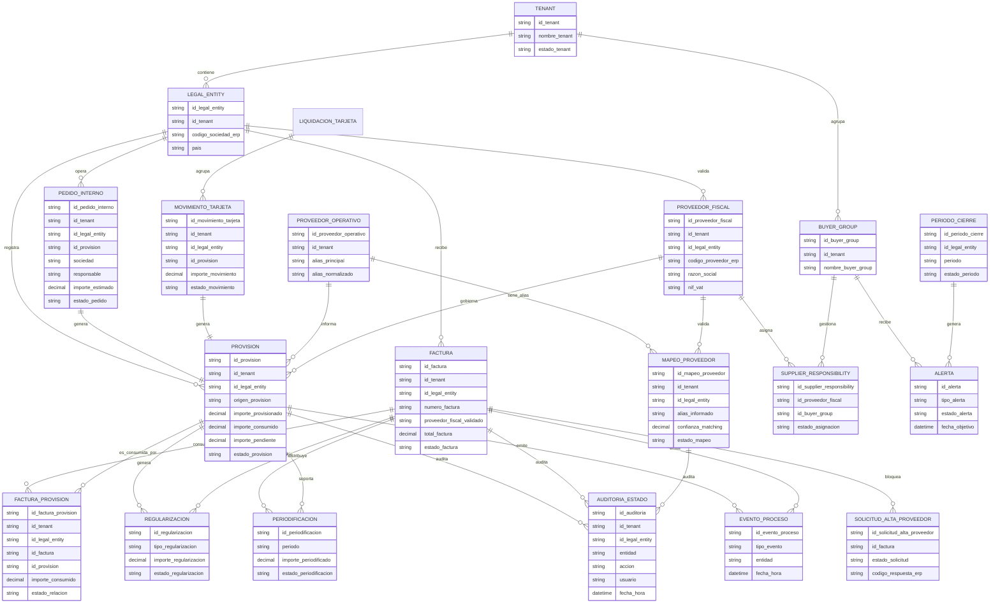
